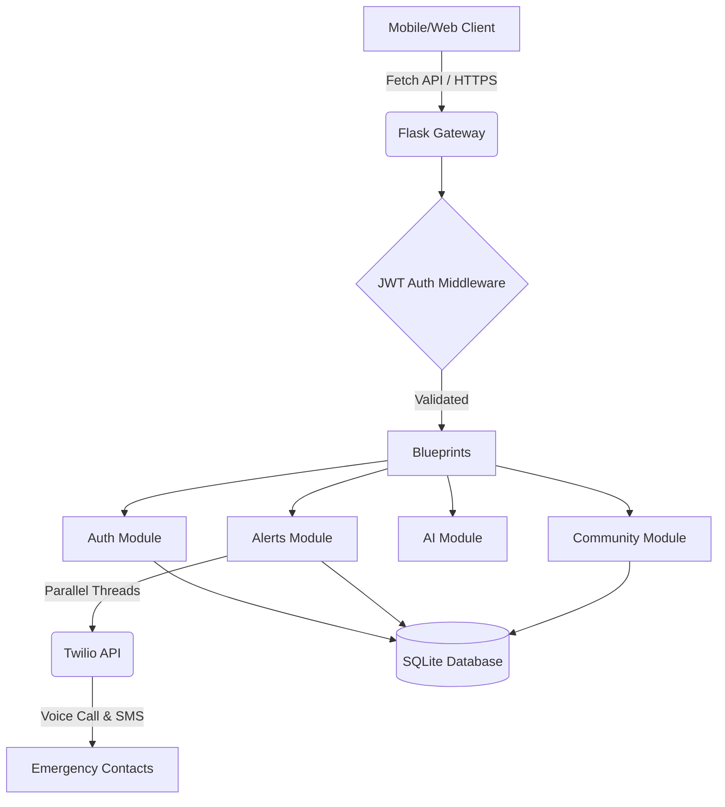

# SAKHI - You Me & Her 🛡️

   

SAKHI (You Me & Her) is a comprehensive, AI-enhanced Progressive Web Application (PWA) built specifically for women's safety. It provides immediate, global SOS alerts to trusted emergency contacts, live location sharing, and AI-driven risk scoring. 

This project was developed as a **BCA Final Year Project**, demonstrating advanced modular backend architecture, synchronous third-party API integration, and modern frontend asynchronous design.

## ✨ Core Features
* **One-Tap SOS & Shake Detection:** Trigger an emergency alert manually, or automatically via phone hardware accelerometer (shaking).
* **Instant Voice & SMS Notifications:** Integrated with the **Twilio API** to immediately ring emergency contacts' phones and send them a Google Maps link to your live location.
* **Progressive Web App (PWA):** Installs natively on mobile devices via a Service Worker with a Network-First strategy for caching.
* **Artificial Intelligence Risk Engine:** Analyzes current GPS coordinates, time of day, and community reports to instantly generate an area Safety Score.
* **JWT Security:** Completely stateless, hardened authentication using JSON Web Tokens.

---

## 🏗️ System Architecture



## 🛠️ Technology Stack
* **Frontend:** Vanilla JS (ES6+), Bootstrap 5, Leaflet.js (Live Mapping), Chart.js
* **Backend:** Python, Flask, Flask-JWT-Extended, Flask-Cors
* **Database:** SQLite (managed via SQLAlchemy ORM)
* **APIs:** Twilio Programmable Voice/Messaging, Google Maps URI

## ⚡ Quick Start & Deployment

### Local Setup
1. **Clone the repository:**
   ```bash
   git clone https://github.com/your-username/wsas-project.git
   cd wsas-project
   ```
2. **Install Python Dependencies:**
   ```bash
   pip install -r requirements.txt
   ```
3. **Set up Environment Variables:** (Create a `.env` file)
   ```ini
   FLASK_SECRET_KEY=super_secret_key
   JWT_SECRET_KEY=jwt_super_secret_key
   TWILIO_ACCOUNT_SID=your_twilio_sid
   TWILIO_AUTH_TOKEN=your_twilio_token
   TWILIO_PHONE_NUMBER=+1234567890
   ```
4. **Run the Server:**
   ```bash
   python app.py
   ```
   *The application will be universally accessible at http://127.0.0.1:5000*

### Cloud Deployment
SAKHI is configured for easy serverless/cloud deployment. Simply connect your GitHub repository to **Render**, set your Build Command to `pip install -r requirements.txt`, and your Start Command to `gunicorn app:app`.

---
*Built with ❤️ for a safer tomorrow.*
